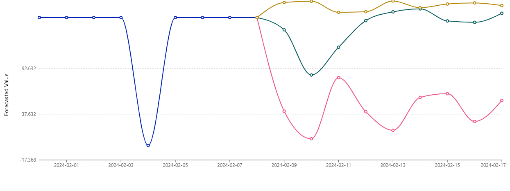

#Previsão de Estoque Inteligente

Este projeto visa criar um modelo de Machine Learning para prever o estoque de produtos utilizando o Amazon SageMaker Canvas. Este README detalha o processo de criação do modelo, incluindo seleção de dados, construção e treinamento do modelo, análise de resultados e previsões.

## Passo a Passo

### 1. Selecionar Dataset

Dataset utilizado: dataset-1000-com-preco-promocional-e-renovacao-estoque.csv
Informações contidas no dataset:
ID_PRODUTO (long): Identificador único do produto
DATA_EVENTO (date): Data do evento relacionado ao produto
PRECO (float): Preço do produto
FLAG_PROMOCAO (long): Indica se o produto está em promoção
QUANTIDADE_ESTOQUE (long): Quantidade disponível em estoque

### 2. Configuração e Limpeza dos Dados

#### QUANTIDADE_ESTOQUE
**Análise preditiva:** Focada na Quantidade_Estoque em um período de 9 dias, considerando feriados.
Tratamento dos dados:
Remoção de linhas duplicadas
Substituição de valores ausentes em PRECO pela média dos preços
Substituição de valores ausentes em QUANTIDADE_ESTOQUE por zero

#### PRECO
**Análise preditiva:** Focada na Preco em um período de 9 dias, considerando feriados com agrupamento de previsão pelos valores na coluna.
Tratamento dos dados:
Remoção de linhas duplicadas
Substituição de valores ausentes em PRECO pela média dos preços
Substituição de valores ausentes em QUANTIDADE_ESTOQUE por zero

### 3. Análise dos Dados

**V.1 - QUANTIDADE/DATA**
Método de construção do modelo: Quick build (10-20 minutos)
-Métricas obtidas:
Avg. wQL: 0.259
MAPE: 1.803
WAPE: 0.378
RMSE: 29.146
MASE: 1.393
-Impactos nas variáveis:
PRECO: 34.81%
Holiday_BR: 1.89%
FLAG_PROMOCAO: 0%

**V.2 - PRECO(MEDIA)/ITEM**
Método de construção do modelo: Quick build (10-20 minutos)
-Métricas obtidas:
Avg. wQL: 0.357
MAPE: 0.511
WAPE: 0.536
RMSE: 38.999
MASE: 0.902
-Impactos nas variáveis:
QUANTIDADE_ESTOQUE: 52.96%

### 4. Previsão
Tipo de previsão utilizada: Single prediction
Produtos analisados: IDs 1000, 1005, 1023

**V.1 - QUANTIDADE/DATA**

**V.2 - PRECO(MEDIA)/ITEM**

